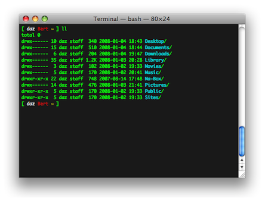

!SLIDE center
# Command-line Tips #

!SLIDE center
* 

!SLIDE center
* 

!SLIDE subsection center
# Cool Stuff #
* 

!SLIDE bullets incremental small
# Navigating on a line #

* Beginning: ctrl-a
* End: ctrl-e
* Back one word: meta-b
* Forward one word: meta-f

* Capslock, the most useless key!

!SLIDE bullets incremental
# Previous Commands #

* Recursive search: ctrl-r
* last command: !!
* Nth last command: !-N
* prev command: !xyz (or !?xyz?)

!SLIDE commandline incremental
    $ cat /etc/passwd
    Permission denied
    $ sudo !!
    sudo cat /etc/passwd
    root:*:0:0:root:/var/root:/bin/sh

    $ grep foo *.txt
    $ echo bar
    bar

    $ !-2
    grep foo *.txt

    $ !?foo?
    grep foo *.txt

    $ !ech
    echo bar
    bar

!SLIDE bullets incremental
# Arguments #

* all arguments: !\*
* last argument: meta-. (or !!:$)
* 3rd and 4th args: !!:3-4
* search/replace: ^foo^bar

!SLIDE commandline incremental
    $ echo foo bar baz

    $ echo !!:2-3
    echo bar baz

    $ ^baz^quux
    echo bar quux

!SLIDE bullets incremental
# Directories #

* prev dir: cd -
* pushd & popd

!SLIDE commandline incremental
    $ pwd
    /etc/log/blah/blah/blah

    $ pushd .

    $ cd /other/directory/far/far/away
    $ do my thing

    $ popd
    $ pwd
    /etc/log/blah/blah/blah

!SLIDE subsection center
# Ultra Cool Stuff #
* 

!SLIDE bullets incremental
# building a complex command? #
* use ctrl-x e

!SLIDE bullets incremental
# need a better tail command? #
* less, then shift-f

!SLIDE incremental commandline
# need a quick timer? #
    $ time cat
    ctrl-d
    real  3m3.224s
    user  0m0.001s
    sys 0m0.003s

!SLIDE incremental commandline
# annoying grep output in your ps listing? #
    $ ps aux | grep ruby
    gar 1234 /usr/bin/ruby blah.rb
    gar 1235 grep ruby <--- uck!

    $ ps aux | grep [r]uby
    gar 1234 /usr/bin/ruby blah.rb

!SLIDE incremental commandline
# need to interact with a server? #
    $ cat < /dev/tcp/time.nist.gov/13
    55581 11-01-20 23:50:52 00 0 0 812.6 UTC(NIST) *

!SLIDE command
# $ echo "that's all folks!" #
